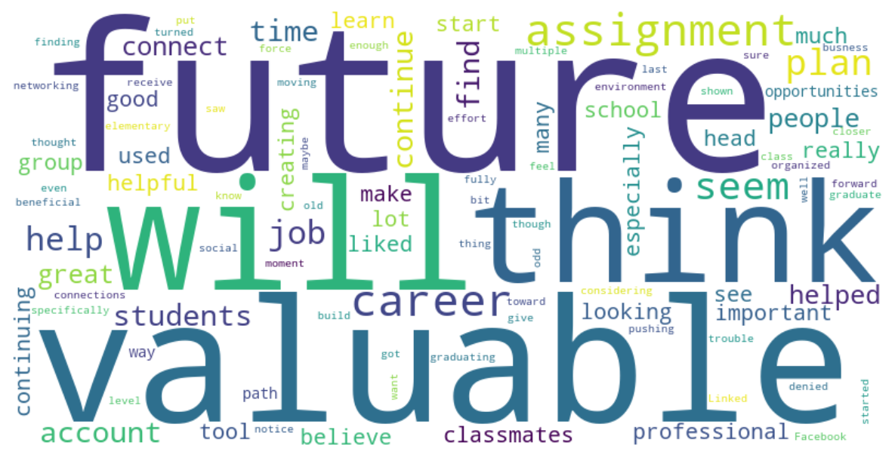
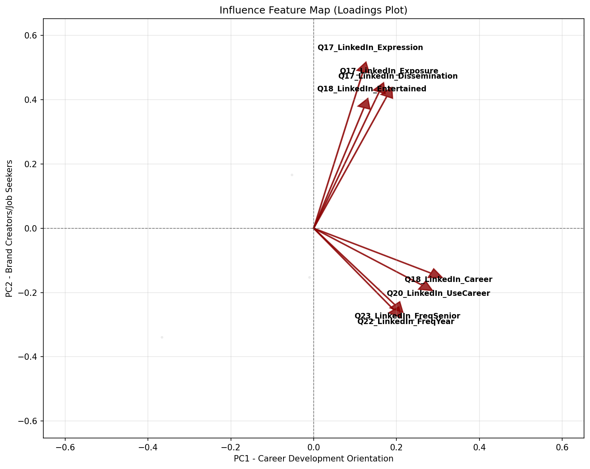
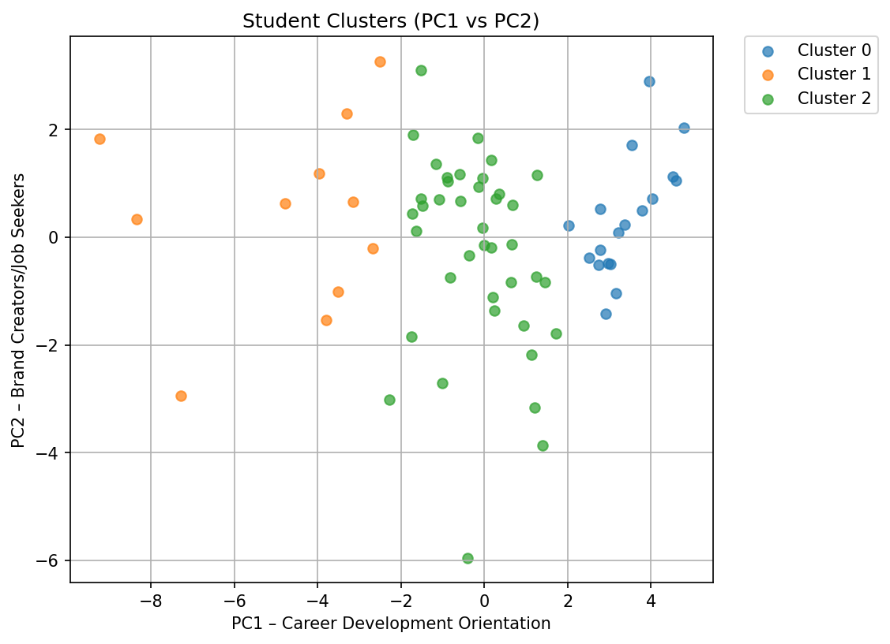

# 📈 Networking Estratégico en LinkedIn: Cómo Maximizar el Engagement para Estudiantes Universitarios.

## 🎯 Problema de Negocio

El networking y la marca personal en LinkedIn son vitales para el éxito laboral, pero existe un vacío de información sobre cómo los estudiantes universitarios adoptan estas herramientas. Tras capacitar a un grupo de estudiantes en estrategias de visibilidad profesional, surge el reto de entender su adopción tecnológica.
Este proyecto utiliza un algoritmo de clustering para responder a la pregunta: 
**¿Cómo podemos segmentar a los estudiantes según su comportamiento digital para diseñar estrategias de marketing que generen experiencias personalizadas y aseguren un alto engagement?**

Este proyecto transforma comportamientos en  **Estrategia de Retención**.

* **Objetivo:** Identificar perfiles de usuario para maximizar el desarrollar estrategias de marketing que generen engagement
* **KPI Impactado:** Tasa de retención

## 🧠 Metodologia
"Implementación de un algoritmo de K-Means Clustering para segmentar estudiantes según su nivel de interacción, red de contactos y uso estratégico de LinkedIn."

* **Población de Estudio:** Estudiantes universitarios que recibieron formación específica en marca personal y visibilidad profesional.
* **Procesamiento de Datos:** [Pandas, NumPy, Matplotlib, Seaborn, WordCloud, Scikit-Learn].
* **Validación:** Selección de 'k' grupos utilizando el método Silhouette Score.

## 👥 Perfiles de Marketing
| Estudiante Tipo| Frase Representativa | Estrategia de Mercadeo |
| :--- | :--- | :--- |
| **Constructor Estrategico** |*“Utilizo LinkedIn como una herramienta clave para construir mi carrera”* | Mentoria - Practicas Universitarias |
| **Observador Exploratorio** |*"Sé que LinkedIn existe y para qué sirve, pero no sé cómo aprovechar todo su potencial."* | Alfabetización digital profesional - ejemplos claros de utilidad|
| **Conocedor Pasivo** | *“LinkedIn es importante, aunque todavía no lo uso activamente”* | Talleres prácticos - Incentivos para la interacción|

## 📊 Visualizaciones
Nube de palabras de los comentarios de los estudiantes:

Los estudiantes reconocen el valor de LinkedIn, pero en el largo plazo
Mapa de variables mas influyentes

Las variables (vectores) que apuntan en la misma dirección revelan:

* *Primer cuadrante:* Estudiantes para quienes la exposición y la visibilidad son más importantes (a veces el doble) que su desarrollo profesional, sin que esto implique que este último sea poco importante.

* *Cuarto cuadrante:* Estudiantes para quienes el desarrollo profesional es moderadamente importante, pero cuyos perfiles no generan visibilidad en la red social.

